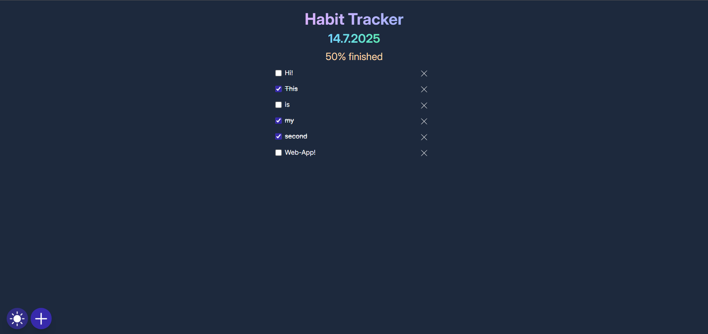
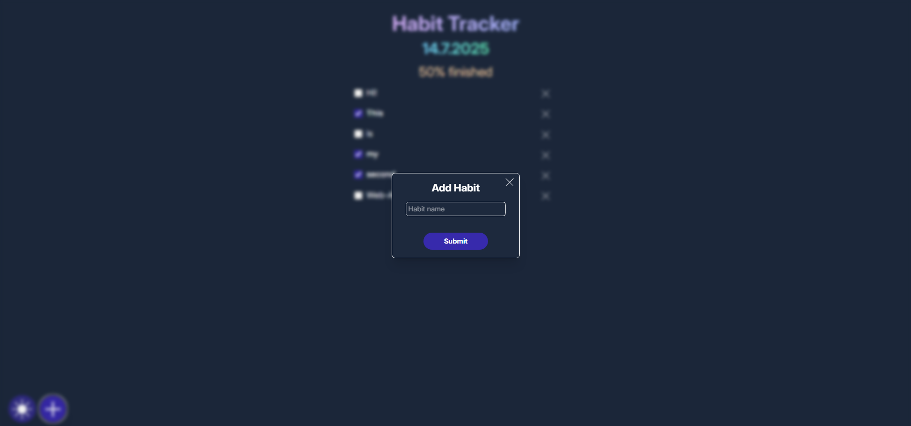
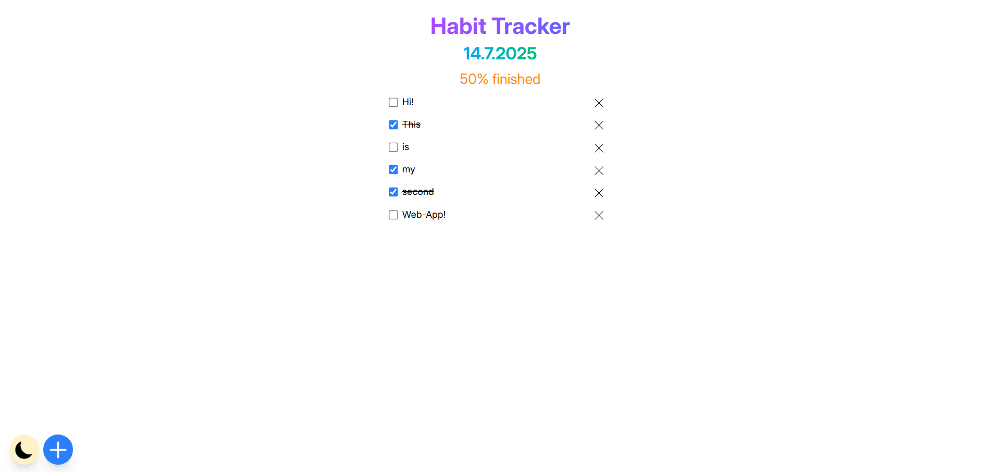
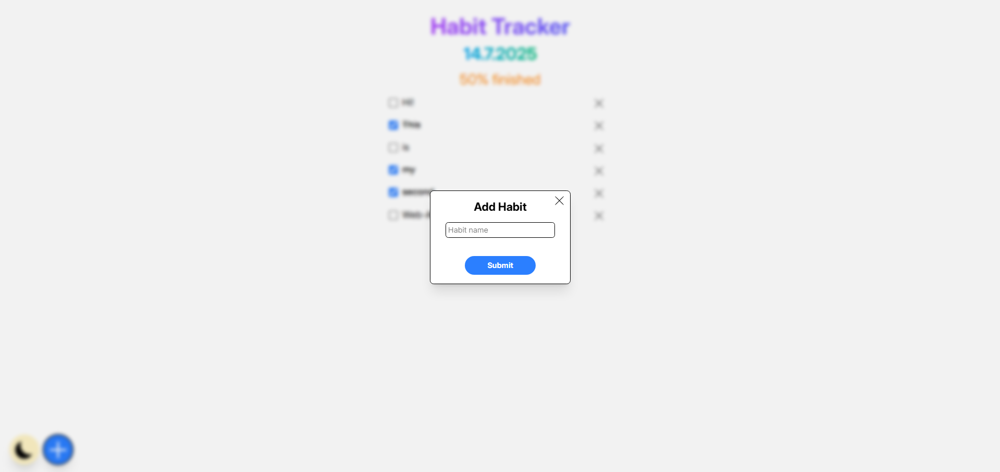

# Habit Tracker
This is my **2nd self-developed JavaScript** project where I created a simple yet functional **Habit Tracker**. It allows you to add, check off, and delete daily habits. 

## Features
- Add new habits dynamically
- Mark habits as completed (with progress percentage)
- Delete habits
- Dark Mode toggle

## Technologies used
- TailwindCSS
- JavaScript

## New JavaScript Concepts (compared to my 1st project)
**Dynamic DOM Manipulation**
- Used insertAdjacentHTML to dynamically add elements.
- Leveraged querySelectorAll and forEach for handling multiple elements.
**Event Delegation**
- Added one click listener for the entire habit list instead of individual elements.

**Dark Mode Toggle**
- Applied and removed the dark class on the <html> element programmatically.

## Screenshots

 
 
 
